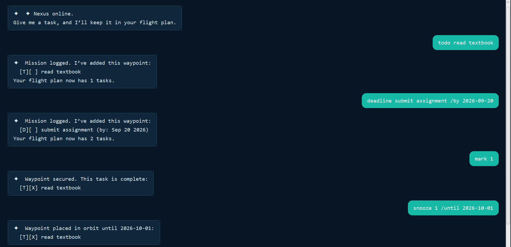

# Nexus User Guide

Nexus is a desktop task chatbot that helps you organize to-dos, deadlines, and events using short commands. Its mission-control theme calls tasks **waypoints** and your task list a **flight plan**.



## Quick start

1. Install Java 25. Run `java -version` to check your version.
2. Place `nexus.jar` in a folder where you want to keep your tasks.
3. Open a terminal in that folder and run `java -jar nexus.jar`.
4. Type `todo read textbook` in the input box, then press **Enter** or click **Launch**.
5. Enter `list` to see your task.

If you have the source project, open PowerShell in the project folder and run:

```powershell
.\gradlew.bat run
```

To build the JAR, run `.\gradlew.bat shadowJar`. The result is `build/libs/nexus.jar`. On macOS or Linux, use `./gradlew` instead of `.\gradlew.bat`.

## Command format

- Enter one command at a time, using lowercase command words.
- Replace placeholders such as `DESCRIPTION` and `NUMBER` with your own values.
- Use single spaces between words and around markers such as `/by`.
- Dates use `yyyy-MM-dd`, for example `2026-09-20`.
- Task numbers start at 1. Read [Task numbers](#task-numbers) before changing tasks after a search or snooze.

## Adding a to-do

Create a task without a date or time.

**Format:** `todo DESCRIPTION`

**Example:** `todo read textbook`

For an initially empty list, Nexus responds:

```text
Mission logged. I’ve added this waypoint:
  [T][ ] read textbook
Your flight plan now has 1 tasks.
```

A description is required. Adding a task with the same displayed details as an existing task is rejected.

## Adding a deadline

Create a task with a due date.

**Format:** `deadline DESCRIPTION /by yyyy-MM-dd`

**Example:** `deadline submit assignment /by 2026-09-20`

The added task appears as:

```text
[D][ ] submit assignment (by: Sep 20 2026)
```

Both the description and date are required. Use a numeric date; words such as `tomorrow` are not accepted.

## Adding an event

Create a task with a start and end time.

**Format:** `event DESCRIPTION /from START /to END`

**Example:** `event project meeting /from 14:00 /to 16:00`

The added task appears as:

```text
[E][ ] project meeting (from: 14:00 to: 16:00)
```

You can include dates using `yyyy-MM-ddTHH:mm`, for example:

```text
event study session /from 2026-09-20T14:00 /to 2026-09-20T16:00
```

When using these numeric time formats, the end must be after the start. Short labels such as `Mon 2pm` and `4pm` are also accepted, but their time order is not checked.

## Listing tasks

**Command:** `list`

Shows tasks that are not currently snoozed, including completed tasks. After adding the to-do, deadline, and project meeting examples above, the list is:

```text
Flight plan telemetry:
1.[T][ ] read textbook
2.[D][ ] submit assignment (by: Sep 20 2026)
3.[E][ ] project meeting (from: 14:00 to: 16:00)
```

`[T]`, `[D]`, and `[E]` mean to-do, deadline, and event. `[ ]` means incomplete; `[X]` means complete. An empty list shows only the heading.

## Finding tasks

**Format:** `find KEYWORD`

**Example:** `find assignment`

Shows tasks whose descriptions contain the keyword, ignoring letter case. The example finds `submit assignment`. Search includes snoozed tasks. If nothing matches, Nexus shows only the matching-results heading.

## Completing and reopening tasks

**Format:** `mark NUMBER`

**Example:** `mark 1`

Marks the selected task complete:

```text
Waypoint secured. This task is complete:
  [T][X] read textbook
```

Use `unmark NUMBER`, for example `unmark 1`, to make the task incomplete again. Its status changes back to `[ ]`.

## Deleting tasks

**Format:** `delete NUMBER`

**Example:** `delete 3`

Removes the selected task and displays the removed task and remaining count. Deletion takes effect immediately and has no undo command. Later tasks shift down by one position.

## Snoozing tasks

**Format:** `snooze NUMBER /until yyyy-MM-dd`

**Example:** `snooze 1 /until 2099-01-01`

Hides the selected task from `list` until the specified date. Choose a date after today, based on your computer's date. The task remains searchable with `find` and still counts toward the total task count. Enter `list` on or after the chosen date to see it again during the same running session.

Snoozing does not change a task's deadline or completion status. Snooze dates are not retained after restarting Nexus; see [Saving tasks and current limitations](#saving-tasks-and-current-limitations).

## Task numbers

Commands such as `mark`, `unmark`, `delete`, and `snooze` use the task's position in the full task list, including hidden tasks.

**Current limitation:** `find` and a `list` with snoozed tasks renumber their displayed results from 1. These displayed numbers may not match the full-list positions used by commands.

For example, if task 1 is snoozed, the original task 2 appears as number 1 in `list`, but `mark 1` still changes the hidden task. Use the full-list position from before snoozing, accounting for any deletions. Do not use search-result numbers to select tasks. If you are unsure of the full-list position, avoid changing or deleting tasks by number.

## Saving tasks and current limitations

Nexus automatically writes the task list to `data/nexus.txt` after additions, completion changes, deletions, and snoozes. This path is relative to the folder from which you start the application. Start Nexus from the same folder each time to use the same file.

**Current persistence limitations:**

- Only to-do tasks and their completion status can currently be loaded again.
- If the saved file contains a deadline, event, or invalid record, loading fails and Nexus starts with an empty list. A subsequent task change can overwrite the saved file with that new list.
- Snooze dates are not saved, so to-dos are visible again after restarting.

Keep a backup of `data/nexus.txt` before restarting if you need to preserve task details. Avoid editing the file manually while Nexus is running.

## Closing Nexus

Close the application window to exit. The `bye` command is supported only by the console interface; it does not close the graphical application.

## Troubleshooting

| Problem | What to do |
| --- | --- |
| Unknown command | Use a command from the summary below, in lowercase. For example, enter `todo read textbook` to add a task. |
| Missing description | Add text after `todo`, `deadline`, or `event`. |
| Invalid deadline date | Use `yyyy-MM-dd`, such as `2026-09-20`. |
| Invalid task number | Use a positive whole number within the full task list. See the task-number limitation above. |
| Repeated-space error | Use a single space between words and command markers. |
| Snooze date rejected | Choose a date after today in `yyyy-MM-dd` format. |
| Tasks missing after restart | Check the launch folder and the persistence limitations above. |
| Application will not start | Check `java -version` and ensure Java 25 is selected. |

## Command summary

| Action | Command example |
| --- | --- |
| Add a to-do | `todo read textbook` |
| Add a deadline | `deadline submit assignment /by 2026-09-20` |
| Add an event | `event project meeting /from 14:00 /to 16:00` |
| List visible tasks | `list` |
| Search descriptions | `find assignment` |
| Complete a task | `mark 1` |
| Reopen a task | `unmark 1` |
| Delete a task | `delete 3` |
| Snooze a task | `snooze 1 /until 2099-01-01` |
